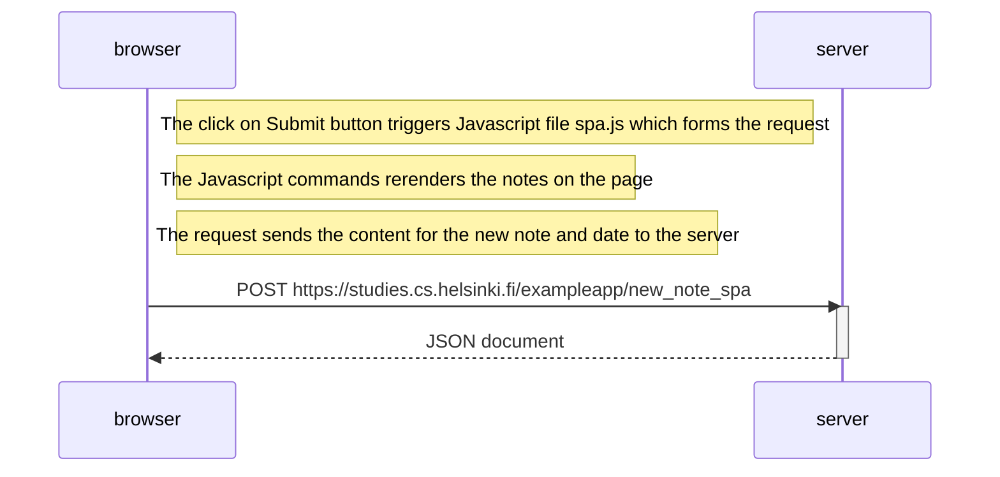

```mermaid
 sequenceDiagram
    participant browser
    participant server

    Note right of browser: The click on Submit button triggers Javascript file spa.js which forms the request
    Note right of browser: The Javascript commands rerenders the notes on the page
    Note right of browser: The request sends the content for the new note and date to the server
    browser->>server: POST https://studies.cs.helsinki.fi/exampleapp/new_note_spa
    activate server
    server-->>browser: JSON document
    deactivate server
  
```